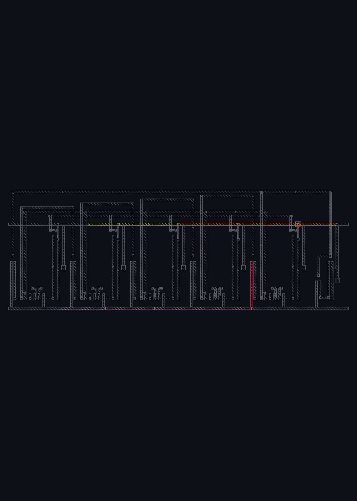
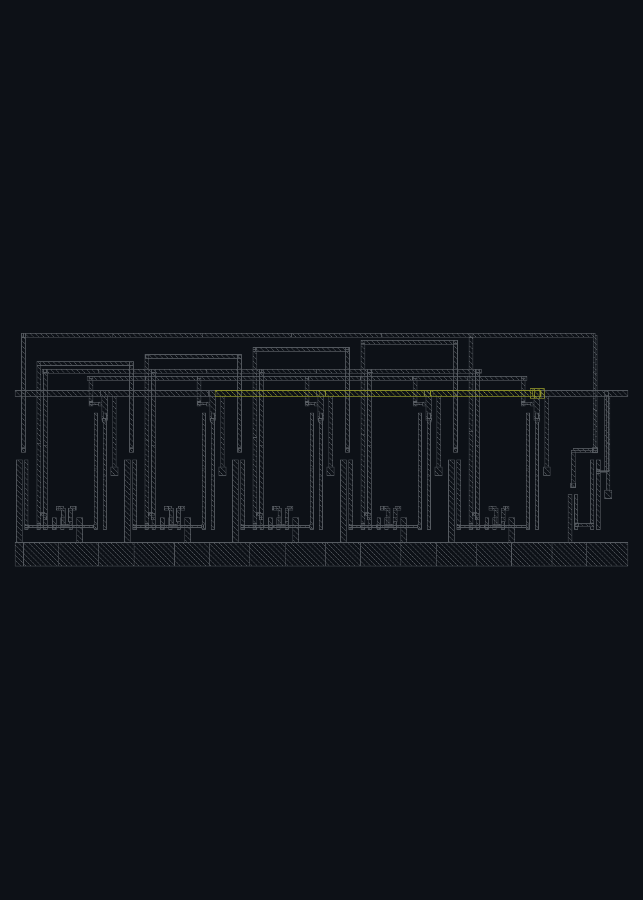

# DualCtrlVCO — ihp130 EM/IR, before → after

A dual-control ring oscillator (VCO) — the oscillator core of a PLL.

Part of the [IHP 130 nm EM/IR showcase](../README.md): real foundry EM limits (LEF
`DCCURRENTDENSITY`), IR budget = 2 % VDD, WC = 125 °C / worst-RCX. See the top-level
README for the tier legend and provenance.

**Operating current**: ≈457 µA VREG / 460 µA VSS — reused from the identical sky130 sizing
(same topology + device sizes; not a fresh sg13g2 measure). Nominals VREG = 1.5 V, VSS = 0 V.
The 27-transistor VCO (5 ring stages + output buffer) was built from scratch in sg13g2 by the
CAL grid engine; the AC decoupling MIM caps are omitted (no DC current → DC EM/IR screen
unaffected).

## v1 (habit-sized) → v2 (flow-repaired)

Measured, DRC/LVS-clean ihp130 result. Screened at the **signoff WC pair** (125 °C, worst-RCX);
the signoff run screens the WC corners, not a separate 25 °C nominal. Full method + repair
detail: [`BEFORE_AFTER.md`](BEFORE_AFTER.md).

| Metric | v1 — before | v2 — after |
|---|---|---|
| Worst EM ratio (I/Imax), WC 125 °C | **3.37×** (VSS Metal1) | **0.99×** (VREG Via1) |
| Worst IR drop vs 30 mV budget | 18.6 mV | 9.9 mV |
| Gating EM violations (> 1.0×) | 15 / 204 segments | 0 / 301 segments |
| Tier-B verdict (real-pdk, 1.0× gate) | **FAIL** | **PASS** |
| DRC / LVS | 0 / match uniquely | 0 / match uniquely |

**Repair effort**: 1 iteration (`dcvco_ihp(wide=True)`) — widened supply source-straps
0.30 → 0.50 µm (asymmetric, toward the cell edge), a VSS Metal1+Metal2 mesh tied by a Via1
array, VREG rail 0.34 → 0.50 µm, and a 2-cut PMOS-source via array. Worst EM **3.37× → 0.99×**.

## Before / after outputs

All artifacts are in `before/` (v1) and `after/` (v2): report `.json/.md/.csv`, `verdict.json`,
`heat.png` (+ `.lyp/.gds`), `repair.json` (directives), `gate.json`, `spef`, per-corner
(`em_wc`/`ir_wc`), and `drc.log` + `lvs.log`. Layout GDS: `../DualCtrlVCO_ihp.gds` (v1),
`../DualCtrlVCO_ihp_v2.gds` (v2).

**v1 — before** (worst 3.37×):

**v2 — after** (worst 0.99×, one repair iteration):

